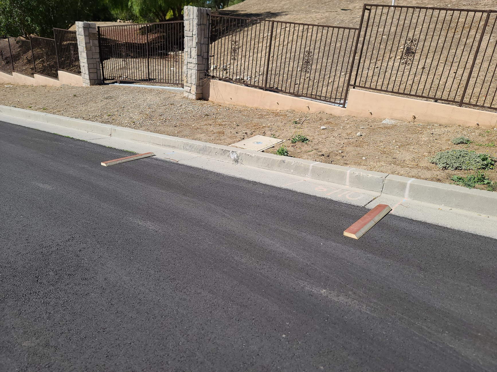

# DataCollector

## Purpose

The C# application in this folder receives data from the [AccelerometerHub](../AccelerometerHub) and a USB GPS module and saves it to CSV files that can be visualized with [Analyzer](../Analyzer).

## Usage

Install Visual Studio Community and load [the solution](DataCollector.sln).  Change the hardcoded value for `BASE_PATH` in [Main.cs](DataCollector/Main.cs) along with the COM ports in `StartSession` for the GPS and AccelerometerHub.  Run the DataCollector application and click Start to begin logging.

The data collection intent is for each run at a "reference pothole" to be captured separately.  So, position behind pothole, start collecting data, run over pothole, stop collecting data, reset and repeat.  The artificial "reference pothole" used to collect the sample data in this repository is shown below.

