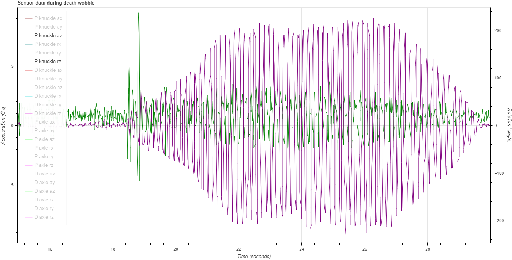
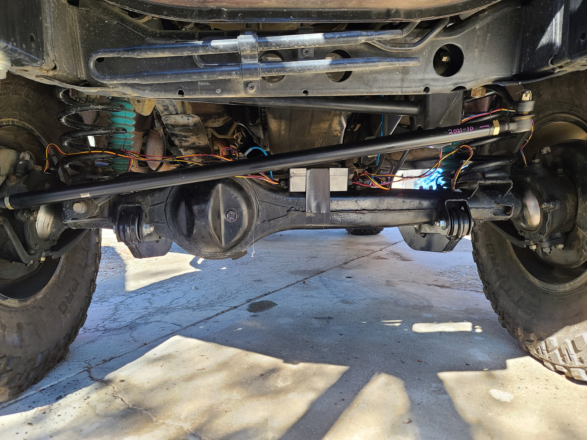

# WobbleTracker

## Purpose

This repository contains basic tools to measure death wobble, tested on a 1993 Toyota Land Cruiser for the purpose of finding the root cause of an episode of death wobble and resolving it per [this thread](https://forum.ih8mud.com/threads/how-can-i-figure-out-why-i-have-death-wobble.1267007/).  The contents of this repository are very quick-and-dirty and likely require some software development experience to use effectively at this point in development.

Death wobble illustration:

## System

[AccelerometerHub](AccelerometerHub) is an Arduino sketch intended to be loaded on an ESP32 connected to four MPU6050 accelerometers.  It reads the accelerometers and sends the data over the USB serial connection to a laptop running [DataCollector](DataCollector) also connected to a USB GPS.  After collecting data (each session consists of `<date>_sensors.csv` and `<date>_gps.csv`), [Analyzer](Analyzer) will generate visualizations (in the visualizations subfolder of the [data](data) folder) for each test run.

